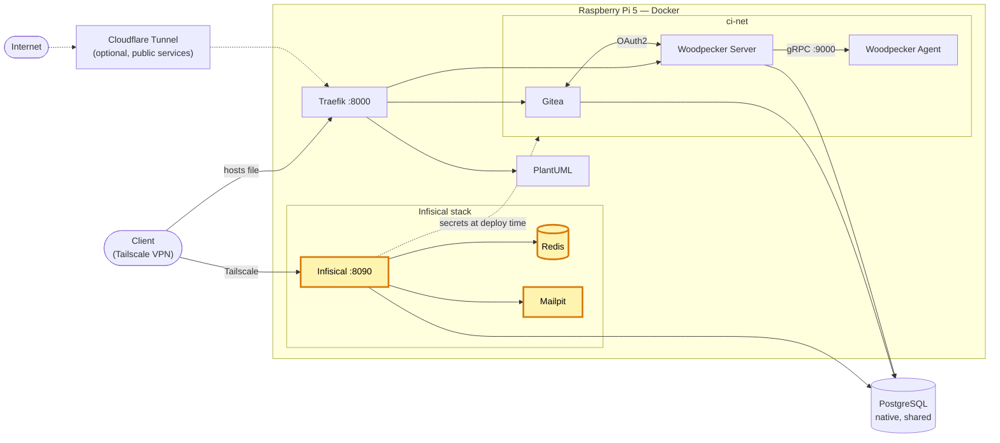

# Infisical — gestionnaire de secrets auto-hébergé (homelab)

[English version](README.md)

[](https://github.com/Alithiel31/infisical-homelab/actions/workflows/lint-markdown.yml) [](LICENSE)   [](https://infisical.com/)

Instance auto-hébergée d'[Infisical](https://infisical.com/) sur un Raspberry Pi 5 faisant office de homelab, destinée à être le gestionnaire de secrets centralisé de l'ensemble des projets (à la place de fichiers `.env` épars par projet).

- **État** : déployé et opérationnel, compte administrateur créé. Premier consommateur : [woodpecker-ci-homelab](https://github.com/Alithiel31/woodpecker-ci-homelab).
- **Accès** : via un tunnel Tailscale privé, sur un port dédié — pas d'exposition publique.

## Vue d'ensemble

Trois conteneurs, réseau Docker par défaut (pas de réseau custom, pas de reverse proxy pour l'instant) :

| Service | Image | Port hôte | Rôle |
|---|---|---|---|
| `infisical` | `infisical/infisical`, épinglée par digest | `8090` → `8080`, lié à localhost et à `TAILSCALE_IP` uniquement | Application principale |
| `infisical-redis` | `redis:7-alpine` | *(aucun, interne uniquement)* | Cache / queue interne (persistance désactivée) |
| `mailpit` | `axllent/mailpit`, épinglée par digest | `8025` (interface web), lié à localhost et à `TAILSCALE_IP` uniquement | Puits SMTP local (port `1025`), déjà branché sur Infisical (`SMTP_*` définies dans le compose) — permet de lire par ex. les emails de réinitialisation de mot de passe |

- **Base de données** : PostgreSQL **mutualisé**, déjà en place sur l'hôte (pas de conteneur Postgres dédié), base (`infisical`) et user applicatif (`infisical_app`) dédiés.
  - Connexion via la passerelle du bridge Docker par défaut (pas de réseau custom, donc pas besoin d'`extra_hosts` / réseau dédié).
  - ⚠️ Une règle firewall doit autoriser le sous-réseau du bridge Docker par défaut vers le port Postgres, sinon la connexion timeout silencieusement.
- **Redis** : pas de port exposé côté hôte, joignable uniquement par `infisical` via le réseau interne du compose.
- **Volumes** : aucun volume déclaré — cohérent car tout l'état persistant (secrets, configuration) vit dans le Postgres externe ; Redis n'est qu'un cache, sa perte au redémarrage n'est pas un problème.
- **Images** épinglées par digest (`sha256:…`), la date d'épinglage figure en commentaire dans `docker-compose.yml`.

## Architecture du homelab

Place de ce projet dans le homelab (en surbrillance) :



## Choix de conception

- Un seul gestionnaire de secrets plutôt qu'un fichier `.env` par projet ; les consommateurs s'authentifient avec une Machine Identity et reçoivent leurs secrets au déploiement.
- PostgreSQL natif mutualisé plutôt qu'un conteneur de base dédié, pour limiter l'empreinte sur un Raspberry Pi.
- Images épinglées par digest : la stack ne change jamais sans décision explicite.
- Joignable uniquement via Tailscale : aucune route publique, pas de reverse proxy nécessaire.

## Prérequis

- Docker + Docker Compose
- Une instance PostgreSQL sur l'hôte, joignable depuis le sous-réseau du bridge Docker
- Tailscale sur l'hôte (les ports publiés sont liés à son adresse)

## Installation

1. **Créer la base et l'utilisateur** sur le Postgres de l'hôte (en tant qu'admin) :

   ```sql
   CREATE USER infisical_app WITH PASSWORD 'un-mot-de-passe-fort';
   CREATE DATABASE infisical OWNER infisical_app;
   ```

   Autoriser le sous-réseau du bridge Docker dans `pg_hba.conf` (adapter le sous-réseau si besoin), puis recharger Postgres :

   ```text
   host    infisical    infisical_app    172.17.0.0/16    scram-sha-256
   ```

2. **Ouvrir le pare-feu** pour ce sous-réseau vers le port Postgres (ex. `ufw allow from 172.17.0.0/16 to any port 5432 proto tcp`).
3. **Configurer** : `cp .env.example .env`, puis renseigner les valeurs (voir ci-dessous).
4. **Démarrer** : `docker compose up -d`, puis ouvrir `INFISICAL_SITE_URL` et créer le compte administrateur.

## Variables d'environnement (`.env`, non commité — voir `.gitignore` et `.env.example`)

| Variable | Description |
|---|---|
| `DB_PASSWORD` | Mot de passe du user Postgres applicatif |
| `DB_HOST` | Adresse de connexion au Postgres mutualisé (passerelle du bridge Docker par défaut, en général `172.17.0.1` ; à vérifier avec `docker network inspect bridge`) |
| `ENCRYPTION_KEY` | Clé de chiffrement Infisical (secrets au repos) — **critique, ne jamais perdre ni faire fuiter**. Génération : `openssl rand -hex 16` |
| `AUTH_SECRET` | Secret de signature des sessions/JWT. Génération : `openssl rand -base64 32` |
| `INFISICAL_SITE_URL` | URL d'accès à Infisical (adresse Tailscale), ex. `http://<hostname>.<tailnet>.ts.net:8090` |
| `TAILSCALE_IP` | Adresse IPv4 Tailscale de l'hôte (`tailscale ip -4`) ; Infisical (`8090`) et Mailpit (`8025`) ne sont publiés que sur elle et sur localhost |
| `SMTP_FROM_ADDRESS` | *(optionnel)* adresse d'expéditeur des emails d'Infisical (défaut `infisical@homelab.internal`) |

## Procédures courantes

- **Démarrage** : `docker compose up -d`
- **Mise à jour** : les images sont épinglées par digest, rien ne bouge tout seul. Pour monter de version, remplacer le digest dans `docker-compose.yml` (et la date du commentaire), puis `docker compose pull && docker compose up -d`.
- **Logs** : `docker logs -f infisical`
- **Arrêt** : `docker compose down` (ne supprime pas les données, tout est dans le Postgres externe).

## Utiliser Infisical depuis les autres projets

Les projets s'authentifient avec une **Machine Identity** (Universal Auth) et la [CLI Infisical](https://infisical.com/docs/cli/overview) : `infisical login` renvoie un token, puis `infisical run -- <commande>` injecte les secrets comme variables d'environnement. Voir `deploy.sh` dans [woodpecker-ci-homelab](https://github.com/Alithiel31/woodpecker-ci-homelab) pour un exemple fonctionnel.

## Notes de sécurité

- Ne jamais perdre `ENCRYPTION_KEY` / `AUTH_SECRET` (voir TODO 1) et ne jamais commiter `.env`.
- L'interface web de Mailpit affiche tous les emails envoyés par Infisical (liens de réinitialisation inclus) : la laisser accessible uniquement via Tailscale.

## Points de vigilance / TODO

1. **Sauvegarde** : `ENCRYPTION_KEY` et `AUTH_SECRET` n'ont, à ce jour, aucune copie de sauvegarde en dehors du `.env` local. Une perte de ce fichier rendrait les secrets stockés dans Postgres illisibles. À stocker dans un second endroit sûr. La base `infisical` doit aussi faire partie des sauvegardes Postgres.
2. **Reverse proxy** : décision à prendre selon l'avancement de la mutualisation des autres projets. Le compose contient un bloc commenté prêt à activer pour router plus tard via [Traefik](https://github.com/Alithiel31/traefik-homelab), avec un sous-domaine interne dédié.
3. **Migration des secrets existants** : les autres projets utilisant encore des `.env` locaux ne sont pas encore migrés vers Infisical.

## Licence

[MIT](LICENSE)
