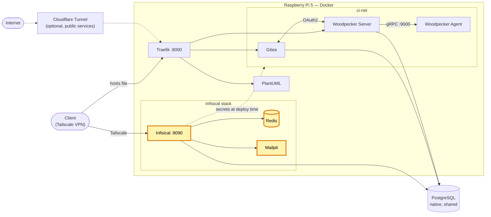

# Infisical — self-hosted secrets manager (homelab)

[Version française](README.fr.md)

[](https://github.com/Alithiel31/infisical-homelab/actions/workflows/lint-markdown.yml) [](LICENSE)   [](https://infisical.com/)

Self-hosted [Infisical](https://infisical.com/) instance running on a Raspberry Pi 5 homelab, meant to be the centralized secrets manager for all projects (replacing scattered per-project `.env` files).

- **Status**: deployed and operational, admin account created. First consumer: [woodpecker-ci-homelab](https://github.com/Alithiel31/woodpecker-ci-homelab).
- **Access**: through a private Tailscale tunnel, on a dedicated port — no public exposure.

## Overview

Three containers, default Docker network (no custom network, no reverse proxy at this stage):

| Service | Image | Host port | Role |
|---|---|---|---|
| `infisical` | `infisical/infisical`, pinned by digest | `8090` → `8080`, bound to localhost and to `TAILSCALE_IP` only | Main application |
| `infisical-redis` | `redis:7-alpine` | *(none, internal only)* | Internal cache / queue (persistence disabled) |
| `mailpit` | `axllent/mailpit`, pinned by digest | `8025` (web UI), bound to localhost and to `TAILSCALE_IP` only | Local SMTP sink (port `1025`), already wired to Infisical (`SMTP_*` set in the compose) — lets you read e.g. password-reset emails |

- **Database**: a **shared** PostgreSQL instance already running on the host (no dedicated Postgres container), with a dedicated database (`infisical`) and application user (`infisical_app`).
  - Connects through the default Docker bridge gateway (no custom network, so no need for `extra_hosts` / a dedicated network).
  - ⚠️ A firewall rule must allow the default Docker bridge subnet to reach the Postgres port, otherwise the connection silently times out.
- **Redis**: no host port exposed, only reachable by `infisical` over the compose's internal network.
- **Volumes**: none declared — expected, since all persistent state (secrets, config) lives in the external Postgres instance; Redis is only a cache, losing it on restart is not an issue.
- **Images** are pinned by digest (`sha256:…`), with the pinning date in a comment in `docker-compose.yml`.

## Homelab architecture

Where this project sits in the homelab (highlighted):



## Design choices

- One secrets manager instead of one `.env` file per project; consumers authenticate with a Machine Identity and receive secrets at deploy time.
- Shared native PostgreSQL rather than a dedicated database container, to keep the footprint small on a Raspberry Pi.
- Images pinned by digest, so the stack never changes without an explicit decision.
- Reachable only over Tailscale: no public route, no reverse proxy needed.

## Prerequisites

- Docker + Docker Compose
- A PostgreSQL instance on the host, reachable from the default Docker bridge subnet
- Tailscale on the host (the published ports are bound to its address)

## Installation

1. **Create the database and user** on the host Postgres (as an admin user):

   ```sql
   CREATE USER infisical_app WITH PASSWORD 'a-strong-password';
   CREATE DATABASE infisical OWNER infisical_app;
   ```

   Allow the Docker bridge subnet in `pg_hba.conf` (adjust the subnet if needed), then reload Postgres:

   ```text
   host    infisical    infisical_app    172.17.0.0/16    scram-sha-256
   ```

2. **Open the firewall** for that subnet towards the Postgres port (e.g. `ufw allow from 172.17.0.0/16 to any port 5432 proto tcp`).
3. **Configure**: `cp .env.example .env`, then fill in the values (see below).
4. **Start**: `docker compose up -d`, then open `INFISICAL_SITE_URL` and create the admin account.

## Environment variables (`.env`, not committed — see `.gitignore` and `.env.example`)

| Variable | Description |
|---|---|
| `DB_PASSWORD` | Password for the Postgres application user |
| `DB_HOST` | Connection address to the shared Postgres instance (default Docker bridge gateway, usually `172.17.0.1`; check with `docker network inspect bridge`) |
| `ENCRYPTION_KEY` | Infisical encryption key (secrets at rest) — **critical, never lose or leak it**. Generate with `openssl rand -hex 16` |
| `AUTH_SECRET` | Session/JWT signing secret. Generate with `openssl rand -base64 32` |
| `INFISICAL_SITE_URL` | URL of Infisical (Tailscale address), e.g. `http://<hostname>.<tailnet>.ts.net:8090` |
| `TAILSCALE_IP` | Tailscale IPv4 address of the host (`tailscale ip -4`); Infisical (`8090`) and Mailpit (`8025`) are published only on it and on localhost |
| `SMTP_FROM_ADDRESS` | *(optional)* sender address of Infisical emails (default `infisical@homelab.internal`) |

## Common operations

- **Start**: `docker compose up -d`
- **Update**: images are pinned by digest, so nothing changes by itself. To upgrade, replace the digest in `docker-compose.yml` (and update the date in the comment), then `docker compose pull && docker compose up -d`.
- **Logs**: `docker logs -f infisical`
- **Stop**: `docker compose down` (does not delete data, everything lives in the external Postgres instance).

## Using Infisical from other projects

Projects authenticate with a **Machine Identity** (Universal Auth) and the [Infisical CLI](https://infisical.com/docs/cli/overview): `infisical login` returns a token, then `infisical run -- <command>` injects the secrets as environment variables. See `deploy.sh` in [woodpecker-ci-homelab](https://github.com/Alithiel31/woodpecker-ci-homelab) for a working example.

## Security notes

- Never lose `ENCRYPTION_KEY` / `AUTH_SECRET` (see TODO 1) and never commit `.env`.
- Mailpit's web UI shows every email sent by Infisical (reset links included): keep it reachable only through Tailscale.

## Known caveats / TODO

1. **Backup**: `ENCRYPTION_KEY` and `AUTH_SECRET` currently have no known backup outside the local `.env` file. Losing that file would make the secrets stored in Postgres unreadable. Should be stored in a second safe location. The `infisical` database should also be part of the Postgres backups.
2. **Reverse proxy**: decision still open, depending on how the mutualization effort for other projects progresses. The compose file has a commented-out block ready to enable routing through [Traefik](https://github.com/Alithiel31/traefik-homelab) later, with a dedicated internal subdomain.
3. **Migrating existing secrets**: other projects still using local `.env` files haven't been migrated to Infisical yet.

## License

[MIT](LICENSE)
